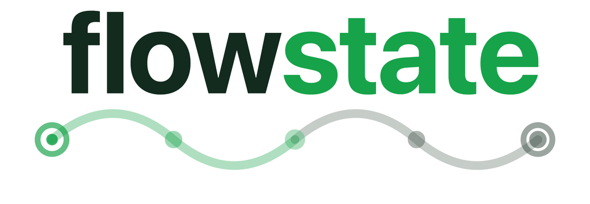

<p align="center">
  <picture>
    <source media="(prefers-color-scheme: dark)" srcset="logo.png" width="360">
    <source media="(prefers-color-scheme: light)" srcset="logo-light.png" width="360">
    
  </picture>
</p>

<p align="center">
  State-machine orchestration for AI agents. Define workflows as directed graphs where nodes are tasks and edges are transitions. Works with any <a href="https://agentclientprotocol.com/get-started/introduction">ACP-compatible</a> agent runtime — Claude Code, custom agents, or any provider that implements the Agent Communication Protocol.
</p>


## Why

Complex AI workflows need structure. Flowstate gives you:

- **A custom DSL** to define flow topology at a glance, with static analysis that catches graph errors before execution
- **Transparent routing** — every decision is logged with reasoning and auditable
- **Developer control** — pause, cancel, retry at any point via the web UI
- **Budget guards** to prevent runaway costs

## Example

```js
flow discuss_flowstate {
    budget = 30m
    context = handoff

    input {
        topic: string = "why Flowstate is a great system"
    }

    entry moderator {
        prompt = "Facilitate a discussion between Alice and Bob about: {{topic}}"
    }

    task alice {
        prompt = "You are Alice. Read the moderator's prompt, then contribute 1-2 points."
    }

    task bob {
        prompt = "You are Bob. Respond to Alice with your own perspective."
    }

    exit done {
        prompt = "Summarize the top insights from the discussion."
    }

    moderator -> alice
    alice -> bob
    bob -> moderator
    moderator -> done when "consensus reached"
}
```

The DSL supports conditional routing, fork/join parallelism, cross-flow filing, wait/fence synchronization, and more. See [`specs.md`](specs.md) for the full specification.

## Quick start

Requires Python 3.12+ and [uv](https://docs.astral.sh/uv/).

```bash
# Install
git clone https://github.com/trupin/flowstate.git
cd flowstate
uv sync

# Validate a flow file
uv run flowstate check demo/unit_test_gen.flow

# Start the server + UI
uv run flowstate server
```

The web UI is available at `http://localhost:8642`. The React frontend dev server (with hot reload) can be started separately:

```bash
cd ui && npm install && npm run dev
```

## Architecture

```bash
src/flowstate/
├── dsl/      # Lark parser + type checker
├── state/    # SQLite persistence
├── engine/   # Execution engine, subprocess manager, judge, budget
├── server/   # FastAPI + WebSocket + CLI
ui/           # React + React Flow frontend
```

Dependency direction: `dsl <- state <- engine <- server`. The UI is fully independent.

All runtime data lives in `~/.flowstate/` (database, run artifacts, config) — Flowstate never writes metadata to your project directories.

## Core concepts

| Concept | Description |
|---------|-------------|
| **Flow** | A named directed graph defining a workflow with budget, input/output fields, and error policy |
| **Node** | A vertex: `entry`, `task`, `exit`, `wait`, `fence`, or `atomic` |
| **Edge** | A connection: unconditional (`->`), conditional (`when`), fork/join (`[A, B]`), or cross-flow (`files`, `awaits`) |
| **Judge** | A separate subprocess that evaluates routing conditions (or tasks can self-report via `DECISION.json`) |
| **Context** | `handoff` (fresh session + summary), `session` (resumed conversation), or `none` |

## Development

```bash
uv run pytest                     # run tests
uv run ruff check .               # lint
uv run pyright                    # type check
cd ui && npm run lint             # UI lint
```

## Contributing with Claude Code

This project is built with [Claude Code](https://claude.ai/claude-code) using a multi-agent architecture. The entire development workflow — from planning to implementation to evaluation — is driven by Claude Code agents and slash commands.

### Issue tracker

Issues live in `issues/` as structured markdown files, organized by domain:

```
issues/
├── PLAN.md              # Phased execution plan with dependency tracking
├── TEMPLATE.md          # Issue file format
├── dsl/                 # DSL-* issues (parser, type checker)
├── state/               # STATE-* issues (SQLite persistence)
├── engine/              # ENGINE-* issues (executor, judge, budget)
├── server/              # SERVER-* issues (API, WebSocket, CLI)
├── ui/                  # UI-* issues (React frontend)
├── shared/              # SHARED-* issues (cross-domain)
├── evals/               # Evaluator verdict files
└── sprints/             # Sprint contract files
```

`PLAN.md` is the master plan — a table of all issues across phases with status and dependency tracking. To find what to work on, look for issues with status `todo` whose dependencies are all `done`.

### Agents

Claude Code agents are defined in `.claude/agents/`. Each domain has a dedicated agent that knows its module, its constraints, and its test patterns:

| Agent | Domain | What it does |
|-------|--------|-------------|
| `dsl-dev` | `src/flowstate/dsl/` | Lark grammar, parser, type checker |
| `state-dev` | `src/flowstate/state/` | SQLite schema, repository, models |
| `engine-dev` | `src/flowstate/engine/` | Executor, subprocess manager, judge, budget |
| `server-dev` | `src/flowstate/server/` | FastAPI, WebSocket, CLI, config |
| `ui-dev` | `ui/` | React, React Flow, WebSocket hooks |

There are also specialized agents for cross-cutting concerns: `evaluator` (tests the running app like a skeptical user), `sprint-planner` (defines testable "done" criteria), `spec-writer` (turns vague ideas into structured specs), and `context-manager` (session continuity across conversations).

### Slash commands

Reusable skills in `.claude/skills/` are invoked as slash commands:

| Command | Purpose |
|---------|---------|
| `/implement` | Pick ready issues from the plan and implement via domain agents |
| `/decompose` | Break a feature into phased issues across domains |
| `/dashboard` | Project status: issues, git state, what's actionable |
| `/test` | Run the test suite |
| `/lint` | Run all linters (ruff, pyright, eslint) |
| `/evaluate` | Run the behavioral evaluator against completed work |
| `/audit` | Check for defects, missing tests, spec drift |
| `/issue` | Create, close, list, or refine issues |
| `/e2e` | Run end-to-end tests with Playwright |
| `/create-flow` | Generate a `.flow` file from a natural language description |

### Workflow

The typical workflow with Claude Code:

1. Run `/dashboard` to see what's ready
2. Run `/implement` — the orchestrator reads `PLAN.md`, finds ready issues, spawns the right domain agents in parallel, and verifies their work
3. Agents implement, test, and lint. The orchestrator commits once everything passes
4. Run `/evaluate` to test the running app against specs

You can also work on individual issues directly by telling Claude Code which issue to implement, or create new issues with `/issue`.

## License

MIT
