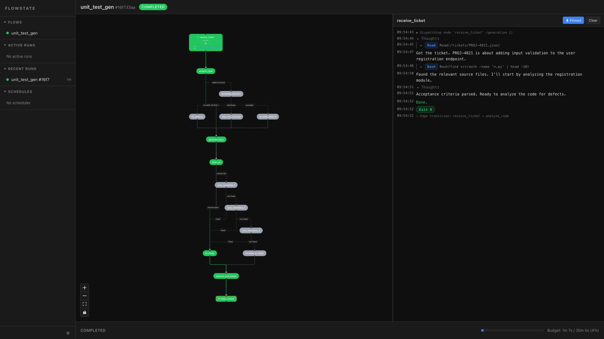

# Flowstate

State-machine orchestration for AI agents. Define workflows as directed graphs where nodes are tasks executed by Claude Code subprocesses and edges are transitions evaluated by judge agents.



## Why

Complex AI workflows need structure. Flowstate gives you:

- **A custom DSL** to define flow topology at a glance, with static analysis that catches graph errors before execution
- **Transparent routing** — every decision is logged with reasoning and auditable
- **Developer control** — pause, cancel, retry at any point via the web UI
- **Budget guards** to prevent runaway costs

## Example

```
flow discuss_flowstate {
    budget = 30m
    context = handoff

    input {
        topic: string = "why Flowstate is a great system"
    }

    entry moderator {
        prompt = "Facilitate a discussion between Alice and Bob about: {{topic}}"
    }

    task alice {
        prompt = "You are Alice. Read the moderator's prompt, then contribute 1-2 points."
    }

    task bob {
        prompt = "You are Bob. Respond to Alice with your own perspective."
    }

    exit done {
        prompt = "Summarize the top insights from the discussion."
    }

    moderator -> alice
    alice -> bob
    bob -> moderator
    moderator -> done when "consensus reached"
}
```

The DSL supports conditional routing, fork/join parallelism, cross-flow filing, wait/fence synchronization, and more. See [`specs.md`](specs.md) for the full specification.

## Quick start

Requires Python 3.12+ and [uv](https://docs.astral.sh/uv/).

```bash
# Install
git clone https://github.com/trupin/flowstate.git
cd flowstate
uv sync

# Validate a flow file
uv run flowstate check demo/unit_test_gen.flow

# Start the server + UI
uv run flowstate server
```

The web UI is available at `http://localhost:8642`. The React frontend dev server (with hot reload) can be started separately:

```bash
cd ui && npm install && npm run dev
```

## Architecture

```
src/flowstate/
├── dsl/      # Lark parser + type checker
├── state/    # SQLite persistence
├── engine/   # Execution engine, subprocess manager, judge, budget
├── server/   # FastAPI + WebSocket + CLI
ui/           # React + React Flow frontend
```

Dependency direction: `dsl <- state <- engine <- server`. The UI is fully independent.

All runtime data lives in `~/.flowstate/` (database, run artifacts, config) — Flowstate never writes metadata to your project directories.

## Core concepts

| Concept | Description |
|---------|-------------|
| **Flow** | A named directed graph defining a workflow with budget, input/output fields, and error policy |
| **Node** | A vertex: `entry`, `task`, `exit`, `wait`, `fence`, or `atomic` |
| **Edge** | A connection: unconditional (`->`), conditional (`when`), fork/join (`[A, B]`), or cross-flow (`files`, `awaits`) |
| **Judge** | A separate subprocess that evaluates routing conditions (or tasks can self-report via `DECISION.json`) |
| **Context** | `handoff` (fresh session + summary), `session` (resumed conversation), or `none` |

## Development

```bash
uv run pytest                     # run tests
uv run ruff check .               # lint
uv run pyright                    # type check
cd ui && npm run lint             # UI lint
```

## License

MIT
